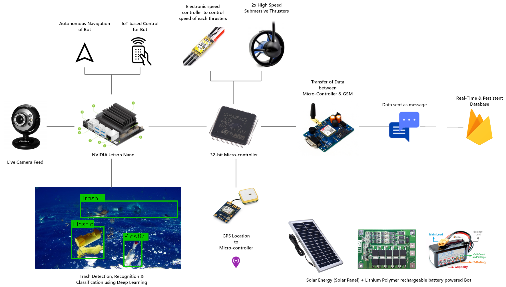
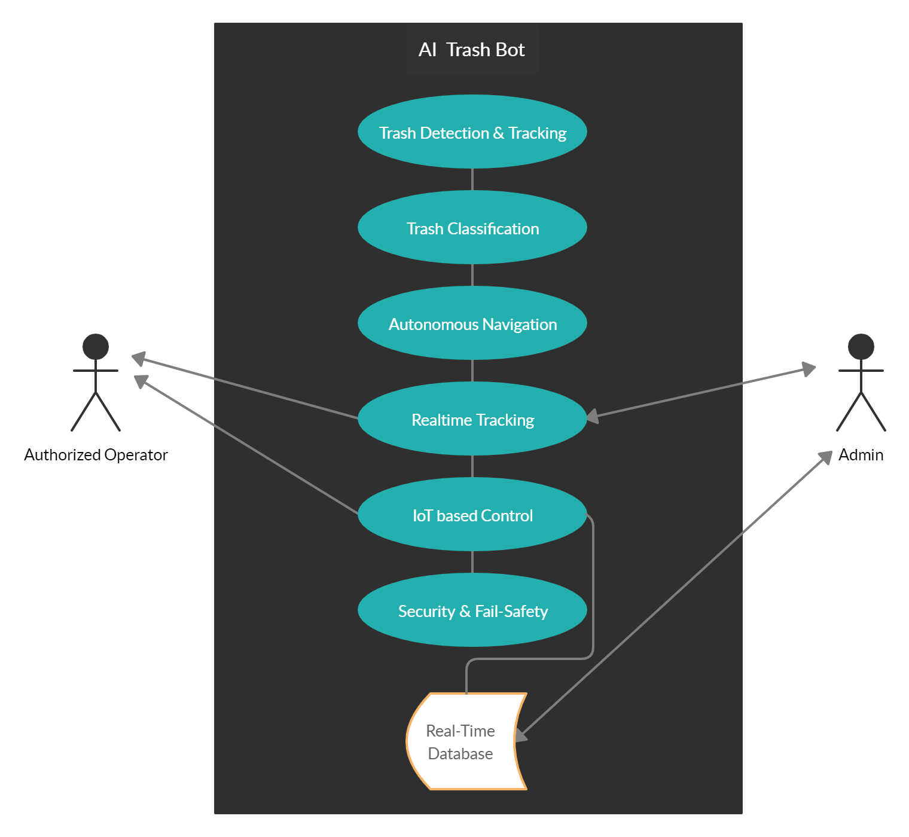

# ACT.AI

**ACT.AI** is a trash cleaning bot for rivers, urban drains, lakes. etc. which is based on **Artificial Intelligence (AI) & Computer Vision (CV)** specially developed for India.

## Project Description

The bot contains a wide angle camera that acts as the eye (vision) for the bot which helps in recognising the scene in front of it, which is connected to a powerful single board computer which helps in process the video frames from the camera. The detection is done through Open CV and the recognizing is done using **Artificial Intelligence** by combining various critical algorithms of **Convolutional Neural Network (CNN) and Recurrent Neural Network (RNN)**. The recognition includes the things that are collectible and things that should be avoided to prevent from the bot getting damaged. The things that should be avoided includes huge rocks, shore, huge log of tree, etc. Whereas the things that should be collected includes plastics bottles, cardboards, papers and all floating waste. 

The bot is also supported by **Reinforcement Learning** for **autonomous navigation** to collect trash and navigate to areas with trash on the surface of the water body by avoiding obstacles and moving on its own.

After recognising the collectable wastes, the bot is driven towards it with the help of two powerful thrusters which is driven by separate **Electronic Speed Controller (ESC)** which is in turn controlled by a **32-bit microcontroller through Pulse Width Modulation (PWM)**. The bot can also be controlled manually anywhere around the world trough **Internet of Things (IoT)**. The driving parameters are obtained from our *online realtime database using a GSM module* that is fixed on to the bot. This values are used to control the directions of the bot, and it can be driven as required.

We also have a **realtime tracking** of the bot about its path. The location of the bot is obtained though the GPS module which is present on the bot. This bot obtains the GNSS values for the satellites and send it to the microcontroller. The microcontroller then parses these values to extract the Latitudes, Longitudes, speed & Timestamp and then sends it to the Realtime database. These values are obtained by the website and plots it on the maps to see the traversed path of the bot and its current location.

The bot is powered with the *Lithium Polymer batteries of high capacity* which gives about **4 hours of drive** once fully charged. Also, **solar panel** is fixed on the bot to harvest solar power whenever the sunlight is available. This helps in *extending the battery life of the bot*.

Once the waste gets filled up the bot moves towards the nearby collection centre with the help of the GPS location that is pre-configured. Thus the nearby collection centre is known and travels to that place and then the trash is collected.

## Work-flow & Use Case

### Work Flow

### Use Case

### Concept Design 

## About

This product was developed by students belonging to various departments of St. Joseph's College of Engineering, Chennai, India.

### Team Members

* Harish Kumar B
* R B Vignesh
* Vaddi Lakshmi Satya Sai Sarojini
* Alvis F
* Arangan Rishikesh T
* Akshay Kumaar M